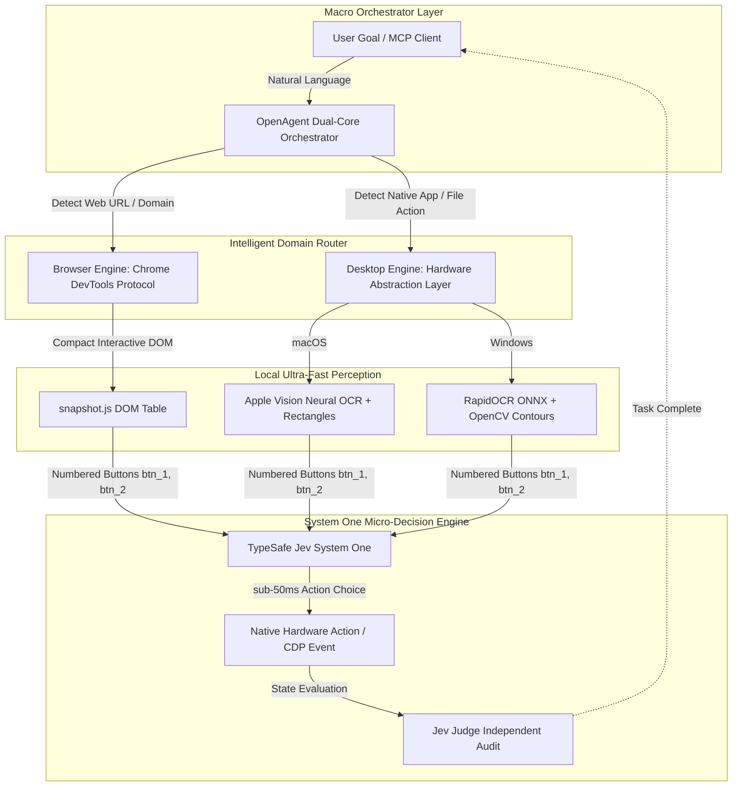

<div align="center">

# 🌐 OpenUse 💻

### The Dual-Core Autonomous Agent Bridging Browser & Desktop Worlds

[](https://opensource.org/licenses/Apache-2.0)
[](https://www.python.org/downloads/)
[]()
[](https://modelcontextprotocol.io/)
[](https://typesafe.ai)

<p align="center">
  <a href="README.md"><b>English</b></a> •
  <a href="README_zh.md"><b>中文说明</b></a>
</p>

*Zero-learning-curve dual-core automation: seamlessly spans Google Chrome and native desktop applications (WeChat, QQ, Office, Finder, Explorer) at sub-second speeds with 98% lower cloud token overhead.*

</div>

---

## ⚡ Key Highlights

- 🌐 **Dual-Core Architecture**: Seamlessly cross the boundary between browser DOM and native OS applications. Automatically dispatch web tasks to CDP and desktop tasks to native HAL.
- ⚡ **Sub-50ms Decision Loop**: Replaces slow 10-second multimodal screenshot upload loops with local **Set-of-Marks (SoM)** and **TypeSafe Jev System One** probabilistic reasoning.
- 💰 **98% Token Reduction**: Eliminates continuous full-screen Retina/4K image uploads to cloud LLMs by using structured interactive button maps (`[1]`, `[2]`, `[3]`).
- 🪟 **True Cross-Platform (macOS & Windows)**:
  - **macOS**: Apple Neural Engine (ANE) Vision OCR (`.accurate`) + CoreGraphics hardware events.
  - **Windows**: RapidOCR (ONNXRuntime / DirectML) + Win32 `SendInput` ctypes + `CF_HDROP` clipboard.
- 🔌 **Native Model Context Protocol (MCP)**: Acts as a standard MCP Server over stdio, bringing native OS control and deep web automation to **Claude Desktop**, **Cursor**, **Windsurf**, and **Zed**.
- 📋 **Zero-Loss File Passing**: Mounts files natively into the OS clipboard buffer, allowing AI agents to copy files from web portals and paste them directly as inline attachments into IM or Office apps.

---

## 📊 Comparison Matrix

| Feature / Capability | Traditional RPA | Claude Computer Use | Browser-Use | **OpenUse** |
| :--- | :--- | :--- | :--- | :--- |
| **Decision Latency** | Static scripts | 4,000 ~ 12,000 ms | 1,000 ~ 3,000 ms | **sub-50 ms** (Jev System One) |
| **Cloud Token Burn** | 0 tokens | ~2,500 tokens / step | ~1,200 tokens / step | **~40 tokens / step (98% drop)** |
| **Browser Execution**| Fragile selectors | Full-screen vision clicks | Native CDP DOM | **Native CDP DOM + Numbered Table** |
| **Desktop Apps** | Windows only (fragile) | macOS / Linux (Vision) | ❌ Not supported | **✅ macOS & Windows (Native HAL)** |
| **Cross-Boundary Handoff**| Custom glue code | ❌ Manual switching | ❌ Web-only | **✅ Unified OpenAgent Pipeline** |
| **MCP Integration** | ❌ No | ❌ Custom API | ⚠️ Experimental | **✅ Standard JSON-RPC 2.0 stdio** |

---

## 🏗 Architecture



---

## 🚀 Quick Start

### 1. Installation

```bash
# Clone repository
git clone https://github.com/ribentianhuang38-boop/open-use.git
cd open-use

# Install in editable mode with core dependencies
pip install -e .

# If on Windows (installs RapidOCR, ONNXRuntime, and mss):
pip install -e ".[windows]"
```

### 2. Configuration

Create a `.env` file or export your API credentials:

```bash
cp .env.example .env
# Edit .env and fill in your JEV_API_KEY (from https://typesafe.ai)
```

---

## 🕹 Usage

### CLI Execution

```bash
# 1. Desktop Mode (Auto-detects macOS or Windows)
openuse --mode desktop --goal "Open QQ and send /tmp/report.pdf to team chat"

# 2. Browser Mode
openuse --mode browser --url "https://portal.example.com" --goal "Export Q3 financial sheet"

# 3. Smart Dual-Core Auto Mode
openuse --goal "Download monthly metrics from https://analytics.company.com and paste into WeChat"
```

### Python SDK

```python
from open_use import OpenAgent

agent = OpenAgent()

# Run a dual-core chained workflow:
# 1. Fetch file from web
agent.run_browser(
    url="https://github.com/ribentianhuang38-boop/open-use",
    goal="Star this repository and copy the clone URL"
)

# 2. Interact with native desktop software
agent.run_desktop(
    goal="Open Terminal and clone the repository to ~/Projects"
)
```

---

## 🔌 Model Context Protocol (MCP) Server

OpenUse exposes 7 high-performance tools conforming to the official **Model Context Protocol (JSON-RPC 2.0)** standard.

### Launch MCP Server
```bash
openuse --mcp
# or: python run.py --mcp
```

### Claude Desktop Configuration
Add to `~/Library/Application Support/Claude/claude_desktop_config.json` (macOS) or `%APPDATA%\Claude\claude_desktop_config.json` (Windows):

```json
{
  "mcpServers": {
    "open-use": {
      "command": "open-use",
      "args": ["--mcp"],
      "env": {
        "JEV_API_KEY": "your_typesafe_jev_key"
      }
    }
  }
}
```

### Cursor Configuration
Add to `.cursor/mcp.json`:

```json
{
  "mcpServers": {
    "open-use": {
      "command": "python",
      "args": ["-m", "open_use.mcp_server"],
      "env": {
        "JEV_API_KEY": "your_typesafe_jev_key"
      }
    }
  }
}
```

### Exposed MCP Tools

| Tool | Parameters | Description |
| :--- | :--- | :--- |
| `open_run` | `goal: str` | Smart dual-core auto-dispatch across browser and native apps |
| `browser_run_goal` | `url: str, goal: str` | Deep CDP web automation without cloud image token burn |
| `desktop_run_goal` | `goal: str, max_steps: int`| OS-level automation via local SoM perception and Jev |
| `desktop_get_buttons`| `none` | Return numbered interactive buttons `[1], [2], [3]` on screen |
| `desktop_click_button`| `button_id: str` | Hardware-level click on a specific numbered button |
| `desktop_type_text` | `text: str` | Send native Unicode keyboard input |
| `desktop_copy_file_to_clipboard` | `file_path: str` | Mount a file to OS clipboard for instant native pasting |

---

## ⚖️ License

Distributed under the **Apache License 2.0**. See [`LICENSE`](LICENSE) for details.

### 🙏 Acknowledgments

- [browser-use](https://github.com/browser-use/browser-use) — Architectural inspiration for CDP web automation patterns.
- [RapidOCR](https://github.com/RapidAI/RapidOCR) — High-performance, offline ONNX OCR engine powering Windows perception.
- [TypeSafe AI](https://typesafe.ai) — Ultra-fast `jev-latest` System One decision and evaluation engine.
