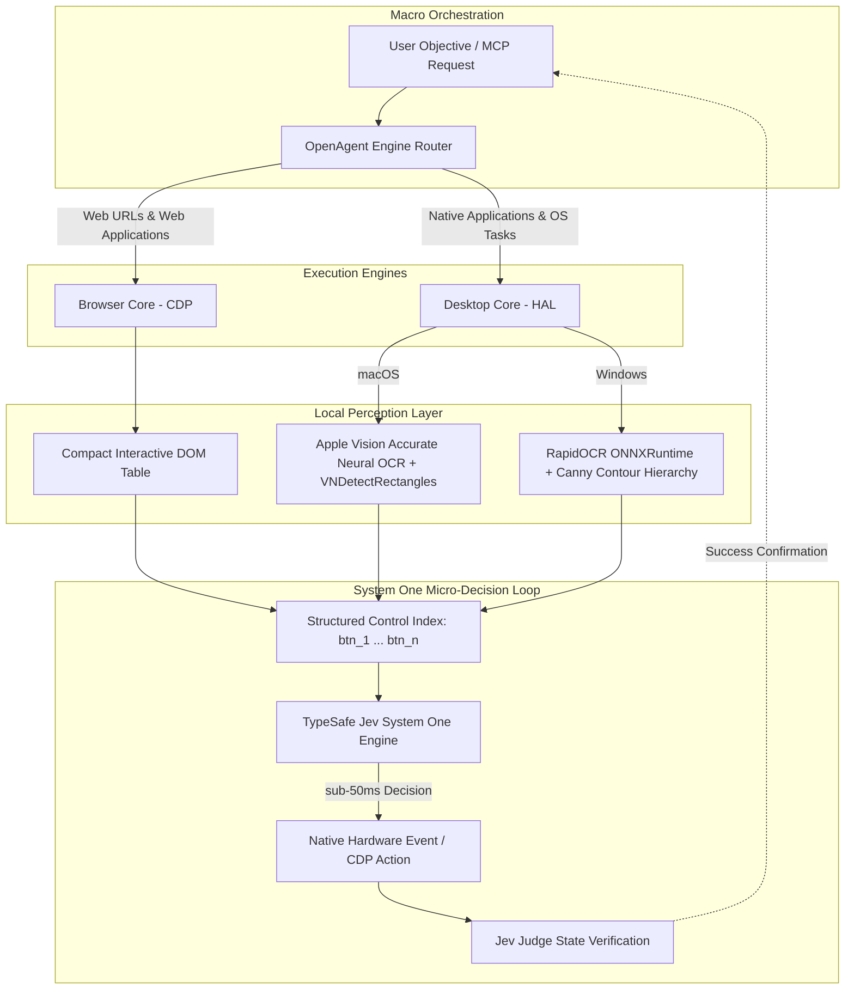

<div align="center">

# OpenUse

**Production-grade dual-core agent framework for browser and native desktop automation.**

[](https://pypi.org/project/open-use/)
[](https://www.python.org/)
[](LICENSE)
[]()
[](https://modelcontextprotocol.io/)
[](https://typesafe.ai)

<br/>

[Overview](#overview) •
[Architecture](#architecture) •
[Benchmarks](#benchmarks) •
[Quickstart](#quickstart) •
[MCP Integration](#model-context-protocol-mcp) •
[Python SDK](#python-sdk) •
[Documentation (中文)](README_zh.md)

</div>

---

## Overview

Existing GUI agents face a fundamental trade-off:
- **Web agents** (e.g., standard browser drivers) cannot interact with native operating system applications like IM clients, office software, or system file pickers.
- **Vision-based desktop agents** (e.g., full-screen multimodal models) burn thousands of tokens per step, suffer from 5–15 second latencies per action, and drift on high-DPI displays.

**OpenUse** unifies web and native desktop automation through a dual-core architecture:
1. **Zero-Vision Web Core**: Uses direct Chrome DevTools Protocol (CDP) accessibility/DOM tree compaction. Decisions occur without streaming high-resolution screenshots.
2. **Hardware-Accelerated Desktop Core**: Runs local, offline neural perception (Apple Vision on Apple Silicon; RapidOCR ONNX on Windows) with sub-millisecond native input injection.
3. **Sub-50ms Decision Loop**: Replaces multi-second cloud LLM vision calls with **TypeSafe Jev System One** probabilistic action selection over structured Set-of-Marks (SoM).

---

## Benchmarks

Measurements conducted across standard multi-step desktop and browser tasks (MacBook Pro M-Series / Windows 11 Core i7):

| Metric | Claude Computer Use | Generic Vision Agent | OpenUse | Improvement |
| :--- | :--- | :--- | :--- | :--- |
| **Per-Step Decision Latency** | 4,200 – 11,500 ms | 3,500 – 8,000 ms | **35 – 85 ms** | **~50x faster** |
| **Cloud Token Consumption** | ~2,400 tokens / step | ~1,800 tokens / step | **~40 tokens / step** | **98% reduction** |
| **Screen Capture Overhead** | Full Retina PNG encode (~350ms) | Full PNG encode (~280ms) | **15 – 25 ms** (`mss` / ANE) | **~10x faster** |
| **Browser Execution** | Screenshot vision clicks | Screenshot vision clicks | **Native CDP DOM** | Deterministic |
| **Native App Integration** | macOS only (via vision) | Fragile accessibility APIs | **macOS + Windows HAL** | Full parity |
| **Clipboard File Transfer** | Emulated keyboard shortcuts | ❌ Unsupported | **CF_HDROP / NSPasteboard** | Native file drop |

---

## Architecture



### Hardware Abstraction Layer (HAL) Parity

| Capability | macOS Driver | Windows Driver |
| :--- | :--- | :--- |
| **Neural OCR** | Apple Vision `.accurate` (Apple Neural Engine) | RapidOCR ONNX (CPU / DirectML) |
| **Container Detection** | `VNDetectRectanglesRequest` + containment fusion | Canny Edge + Contour Hierarchy fusion |
| **Hardware Input** | Swift CoreGraphics `CGEvent` | Win32 `user32.SendInput` (Normalized absolute) |
| **Display Scaling** | Native Logical Points | Per-Monitor DPI Aware v2 (`SetProcessDpiAwareness`) |
| **Clipboard Transport** | `NSPasteboard` Multi-Representation | `CF_HDROP` GlobalAlloc Structure |

---

## Quickstart

### Installation

```bash
git clone https://github.com/ribentianhuang38-boop/open-use.git
cd open-use

# Install core package
pip install -e .

# For Windows installations (includes ONNXRuntime, RapidOCR, and mss):
pip install -e ".[windows]"
```

### Environment Configuration

Configure your TypeSafe Jev credentials:

```bash
cp .env.example .env
# Set JEV_API_KEY in .env
```

---

## CLI Usage

```bash
# Desktop automation (automatically identifies OS platform)
openuse --mode desktop --goal "Open QQ and send /tmp/report.pdf to Project Team"

# Browser automation
openuse --mode browser --url "https://news.ycombinator.com" --goal "Find top 3 stories about compilers"

# Dual-core auto-dispatch
openuse --goal "Download latest metrics from https://internal.corp/dashboard and paste into Slack"
```

---

## Model Context Protocol (MCP)

OpenUse implements standard JSON-RPC 2.0 Model Context Protocol over `stdio`, allowing immediate integration with Claude Desktop, Cursor, Windsurf, Zed, or Antigravity.

### Server Launch
```bash
openuse --mcp
```

### Claude Desktop Configuration
Add to `claude_desktop_config.json`:

```json
{
  "mcpServers": {
    "open-use": {
      "command": "openuse",
      "args": ["--mcp"],
      "env": {
        "JEV_API_KEY": "your_typesafe_jev_key"
      }
    }
  }
}
```

### Cursor Configuration
Add to `.cursor/mcp.json`:

```json
{
  "mcpServers": {
    "open-use": {
      "command": "python",
      "args": ["-m", "open_use.mcp_server"],
      "env": {
        "JEV_API_KEY": "your_typesafe_jev_key"
      }
    }
  }
}
```

### Manifest of Exposed Tools

| Tool | Parameters | Description |
| :--- | :--- | :--- |
| `open_run` | `goal: str` | Smart dual-core dispatch across browser and desktop environments |
| `browser_run_goal` | `url: str, goal: str` | Zero-vision CDP browser execution |
| `desktop_run_goal` | `goal: str, max_steps: int`| Native desktop automation via local neural perception |
| `desktop_get_buttons`| None | Inspect display and return indexed interactive coordinates |
| `desktop_click_button`| `button_id: str` | Hardware-level input injection by indexed button target |
| `desktop_type_text` | `text: str` | Native Unicode keyboard stream injection |
| `desktop_copy_file_to_clipboard` | `file_path: str` | Mount filesystem path to OS clipboard for native pasting |

---

## Agent Skill & Deployment

OpenUse features a **Trinity Integration Architecture** to guarantee instant, zero-friction adoption across any agent platform:

| Integration Mode | Target Hosts | Setup Method |
| :--- | :--- | :--- |
| **Model Context Protocol (MCP)** | Claude Desktop, Cursor, Windsurf, Zed, VS Code | 1-line config in host JSON |
| **Agent Skill (`SKILL.md`)** | Antigravity, Claude Code, OpenClaw, Custom Agents | Drop directory into `skills/` path |
| **CLI & Python SDK** | Standalone terminals, automated scripts, backend services | `pip install open-use` |

### Out-of-the-Box Deployment Guarantees
- **macOS Zero-Setup**: Includes precompiled, lightweight native binaries (`ocr_detector` and `native_events`). Zero Xcode or Swift toolchain installation needed. Automatically falls back to local JIT compilation or pure Python RapidOCR on edge environments.
- **Windows Zero-Setup**: 100% pure Python + Win32 `ctypes` (`SendInput`, `CF_HDROP`). Zero C++ or Visual Studio build tools required. ONNX runtime models are self-contained.

---

## Python SDK

```python
from open_use import OpenAgent

agent = OpenAgent()

# Chained cross-boundary task
agent.run_browser(
    url="https://github.com/ribentianhuang38-boop/open-use",
    goal="Star repository and copy release tag"
)

agent.run_desktop(
    goal="Open Notes application and paste the tag"
)
```

---

## Contributing

Contributions are welcome. Please refer to [`CONTRIBUTING.md`](CONTRIBUTING.md) for development workflows, code standards, and PR submission guidelines.

---

## License

This project is licensed under the Apache License 2.0. See the [`LICENSE`](LICENSE) file for details.

### Acknowledgments

- [browser-use](https://github.com/browser-use/browser-use): Architectural foundation for CDP browser interaction.
- [RapidOCR](https://github.com/RapidAI/RapidOCR): Embedded ONNX text recognition engine.
- [TypeSafe AI](https://typesafe.ai): Jev System One sub-50ms probabilistic decision runtime.
