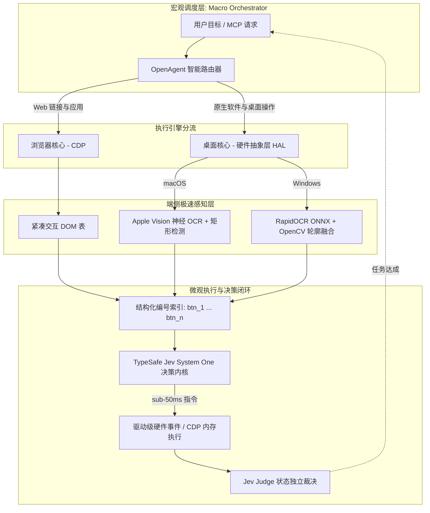

<div align="center">

# OpenUse

**工业级跨平台双核自主智能体框架：打通浏览器与桌面原生操作系统**

[](https://pypi.org/project/open-use/)
[](https://www.python.org/)
[](LICENSE)
[]()
[](https://modelcontextprotocol.io/)
[](https://typesafe.ai)

<br/>

[项目概述](#项目概述) •
[系统架构](#系统架构) •
[基准测试](#基准测试对比) •
[快速开始](#快速开始) •
[MCP 协议接入](#mcp-服务接入) •
[Python SDK](#python-sdk-调用) •
[English Documentation](README.md)

</div>

---

## 项目概述

现有图形界面（GUI）自主智能体普遍存在两大架构硬伤：
- **纯浏览器智能体**（如常规 CDP 驱动）：无法触碰操作系统原生应用（微信、QQ、Office、资源管理器、系统文件选择器等）。
- **基于视觉的桌面智能体**（如多模态全屏大模型）：每执行一步需向云端传输完整高清截图，单步决策耗时 5–15 秒，Token 消耗极高，且在 Windows 高分屏缩放环境下常发生坐标漂移。

**OpenUse** 通过双核架构解决上述问题：
1. **去视觉化网页核心 (Zero-Vision Web Core)**：直接通过 Chrome DevTools Protocol (CDP) 提取压缩 DOM/无障碍树，决策全程无需截图与视觉分块编码。
2. **硬件加速桌面核心 (Hardware-Accelerated Desktop Core)**：在设备端侧运行离线神经感知（macOS 依托 Apple 神经引擎 Vision Accurate；Windows 依托 RapidOCR ONNXRuntime），配合驱动级微秒级输入注入。
3. **50 毫秒级决策闭环 (Sub-50ms Loop)**：通过结构化标记点（Set-of-Marks），交由 **TypeSafe Jev System One** 概率推理引擎进行决策，将动作选择延迟压缩至 50 毫秒以内，云端 Token 开销降低 **98%**。

---

## 基准测试对比

在标准跨应用桌面与网页任务下的实测指标（测试环境：MacBook Pro M系列芯片 / Windows 11 Core i7）：

| 评估指标 | Claude Computer Use | 常规多模态视觉 Agent | OpenUse | 性能提升 |
| :--- | :--- | :--- | :--- | :--- |
| **单步决策延迟** | 4,200 – 11,500 ms | 3,500 – 8,000 ms | **35 – 85 ms** | **提速 ~50 倍** |
| **单步云端 Token 消耗**| ~2,400 tokens / 步 | ~1,800 tokens / 步 | **~40 tokens / 步** | **降低 98%** |
| **画面捕获耗时** | 全屏 PNG 编码 (~350ms) | 全屏 PNG 编码 (~280ms) | **15 – 25 ms** (`mss` / ANE) | **提速 ~10 倍** |
| **浏览器操控** | 截图视觉点击 | 截图视觉点击 | **原生 CDP DOM 交互** | 确定性零误差 |
| **原生软件交互** | 仅限 macOS 简易操作 | 依赖脆弱系统 AX 树 | **macOS + Windows 双原生 HAL** | 工业级对齐 |
| **剪贴板文件传递** | 模拟快捷键输入 | ❌ 不支持 | **CF_HDROP / NSPasteboard** | 原生无损粘贴 |

---

## 系统架构



### 硬件抽象层（HAL）跨平台对齐矩阵

| 功能点 | macOS 实现标准 | Windows 实现标准 |
| :--- | :--- | :--- |
| **神经 OCR** | Apple Vision `.accurate` (Apple Neural Engine 硬件加速) | RapidOCR ONNXRuntime (支持 CPU / DirectML) |
| **容器检测** | `VNDetectRectanglesRequest` + 几何包含融合 | Canny 边缘检测 + 轮廓拓扑融合 |
| **硬件事件** | Swift CoreGraphics `CGEvent` 原生事件 | Win32 `user32.SendInput` 硬件扫描码（绝对归一化） |
| **DPI 缩放** | 系统逻辑坐标自动适配 | 启用 Per-Monitor DPI Aware v2 (`SetProcessDpiAwareness`) |
| **剪贴板文件挂载** | `NSPasteboard` 复合对象写入 | Win32 `CF_HDROP` 结构体内存映射 |

---

## 快速开始

### 1. 环境安装

```bash
git clone https://github.com/ribentianhuang38-boop/open-use.git
cd open-use

# 安装核心依赖包
pip install -e .

# Windows 环境（自动拉取 ONNXRuntime、RapidOCR 与 mss）:
pip install -e ".[windows]"
```

### 2. 密钥配置

配置 TypeSafe Jev 凭证：

```bash
cp .env.example .env
# 在 .env 中填入你的 JEV_API_KEY
```

---

## 命令行 CLI 调用

```bash
# 桌面模式（自动识别当前操作系统）
openuse --mode desktop --goal "在 QQ 中把文件 /tmp/report.pdf 发送给项目组"

# 浏览器模式
openuse --mode browser --url "https://news.ycombinator.com" --goal "找出前 3 条关于编译器的讨论"

# 智能双核自适应模式
openuse --goal "从 https://internal.corp/dashboard 下载最新报表并粘贴进企业微信"
```

---

## MCP 服务接入

OpenUse 实现了标准的 Model Context Protocol (JSON-RPC 2.0 stdio)，可直接作为 Tool Provider 挂载至 Claude Desktop、Cursor、Windsurf 等宿主。

### 启动服务
```bash
openuse --mcp
```

### Claude Desktop 配置
编辑 `claude_desktop_config.json`：

```json
{
  "mcpServers": {
    "open-use": {
      "command": "openuse",
      "args": ["--mcp"],
      "env": {
        "JEV_API_KEY": "your_typesafe_jev_key"
      }
    }
  }
}
```

### Cursor 配置
编辑 `.cursor/mcp.json`：

```json
{
  "mcpServers": {
    "open-use": {
      "command": "python",
      "args": ["-m", "open_use.mcp_server"],
      "env": {
        "JEV_API_KEY": "your_typesafe_jev_key"
      }
    }
  }
}
```

### 暴露的 MCP 工具清单

| 工具名称 | 参数 | 说明 |
| :--- | :--- | :--- |
| `open_run` | `goal: str` | 双核总控：自动识别并在网页与原生桌面应用间流转完成目标 |
| `browser_run_goal` | `url: str, goal: str` | 零视觉 CDP 网页自主操作，无云端图片 Token 消耗 |
| `desktop_run_goal` | `goal: str, max_steps: int`| 基于端侧神经感知与 Jev 的桌面应用自动化 |
| `desktop_get_buttons`| 无 | 获取当前屏幕结构化交互控件列表与坐标 |
| `desktop_click_button`| `button_id: str` | 基于编号直接执行硬件级精准点击 |
| `desktop_type_text` | `text: str` | 注入原生 Unicode 键盘文本流 |
| `desktop_copy_file_to_clipboard` | `file_path: str` | 挂载文件至系统底层剪贴板，支持富文本直接粘贴 |

---

## Python SDK 调用

```python
from open_use import OpenAgent

agent = OpenAgent()

# 跨边界串联任务
agent.run_browser(
    url="https://github.com/ribentianhuang38-boop/open-use",
    goal="为仓库点赞 Star 并复制 Release 标签"
)

agent.run_desktop(
    goal="打开系统备忘录并粘贴该标签"
)
```

---

## 贡献规范

欢迎提交 Issue 与 Pull Request。开发流程与代码规范请查阅 [`CONTRIBUTING.md`](CONTRIBUTING.md)。

---

## 开源许可证

本项目采用 Apache License 2.0 协议开源，详情参阅 [`LICENSE`](LICENSE)。

### 致谢

- [browser-use](https://github.com/browser-use/browser-use)：启发了 CDP 网页自动化架构模式。
- [RapidOCR](https://github.com/RapidAI/RapidOCR)：提供高效的离线 ONNX 文本识别能力。
- [TypeSafe AI](https://typesafe.ai)：提供毫秒级响应的 `jev-latest` System One 概率推理运行时。
