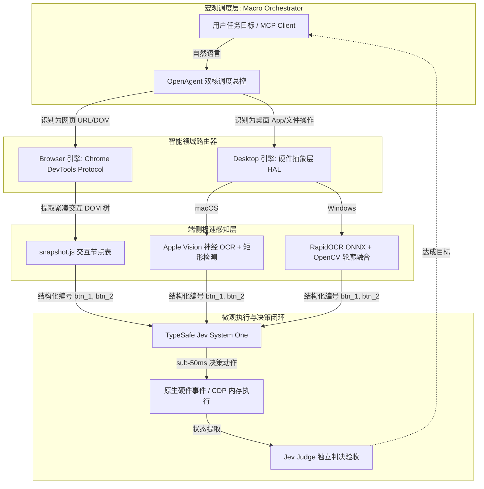

<div align="center">

# 🌐 OpenUse 💻

### 贯通浏览器与桌面原生操作系统的双核自主智能体 (Dual-Core Autonomous Agent)

[](https://opensource.org/licenses/Apache-2.0)
[](https://www.python.org/downloads/)
[]()
[](https://modelcontextprotocol.io/)
[](https://typesafe.ai)

<p align="center">
  <a href="README.md"><b>English</b></a> •
  <a href="README_zh.md"><b>中文说明</b></a>
</p>

*零认知门槛跨端自动化：跨越 Chrome 网页与原生桌面应用（微信、QQ、Office、Finder、资源管理器）边界，以 50 毫秒级决策速度和节省 98% 视觉 Token 的开销实现真正的端到端自主操作。*

</div>

---

## ⚡ 核心优势与技术特色

- 🌐 **双核驱动架构**：自动识别任务边界，网页操作走 CDP 原生 DOM 树控制，桌面操作走 HAL（硬件抽象层）系统原生驱动，支持无缝跨端流水线。
- ⚡ **50 毫秒极速决策闭环**：彻底摒弃传统“每走一步往云端传一次几兆高清大图”的迟钝机制，采用本地 **Set-of-Marks (SoM)** 编号感知结合 **TypeSafe Jev System One** 毫秒级概率决策。
- 💰 **98% 云端 Token 降耗**：将视觉 UI 压缩为结构化按钮映射表（`[1]`, `[2]`, `[3]`），单步仅消耗数十个字符 Token，告别云端视觉费用黑洞。
- 🪟 **真·全跨平台原生支持 (macOS & Windows)**：
  - **macOS**：基于 Apple Neural Engine (ANE) 硬件加速的 Vision 神经 OCR (`.accurate`) + CoreGraphics 驱动级事件。
  - **Windows**：基于 RapidOCR (ONNXRuntime / DirectML) + Win32 `SendInput` 硬件扫描码 + `CF_HDROP` 系统剪贴板挂载。
- 🔌 **原生 Model Context Protocol (MCP)**：标准 JSON-RPC 2.0 stdio 协议封装，一键挂载至 **Claude Desktop**、**Cursor**、**Windsurf** 等任意 MCP 客户端。
- 📋 **复合剪贴板无损穿透**：直接在系统底层剪贴板挂载真实文件对象，实现网页下载文件直接 Ctrl+V 粘贴为微信/QQ 行内文件或图片。

---

## 📊 能力对比矩阵

| 特性 / 指标 | 传统脚本 RPA | Claude Computer Use | Browser-Use | **OpenUse** |
| :--- | :--- | :--- | :--- | :--- |
| **单步决策延迟** | 静态死板脚本 | 4,000 ~ 12,000 ms | 1,000 ~ 3,000 ms | **sub-50 ms** (Jev System One) |
| **单步 Token 消耗** | 0 tokens | ~2,500 tokens / 步 | ~1,200 tokens / 步 | **~40 tokens / 步 (节省 98%)** |
| **浏览器操控深度**| 脆弱的 Selector | 全屏截图视觉点击 | 原生 CDP 交互 | **原生 CDP + 紧凑编号表** |
| **桌面原生软件支持**| 仅 Windows (常崩溃) | macOS / Linux (看大图) | ❌ 不支持桌面应用 | **✅ macOS & Windows 原生 HAL** |
| **跨应用工件管道** | 手写粘合胶水代码 | ❌ 需人工干预切换 | ❌ 仅限纯网页 | **✅ 统一 OpenAgent 自动化流水线** |
| **标准 MCP 协议** | ❌ 无 | ❌ 自定义私有 API | ⚠️ 实验性脚本 | **✅ 标准 JSON-RPC 2.0 stdio** |

---

## 🏗 系统架构



---

## 🚀 快速上手

### 1. 安装项目

```bash
# 克隆仓库
git clone https://github.com/ribentianhuang38-boop/open-use.git
cd open-use

# 以可编辑模式安装核心包
pip install -e .

# 如果在 Windows 环境下（自动安装 RapidOCR、ONNXRuntime 及极速截屏 mss）：
pip install -e ".[windows]"
```

### 2. 配置密钥

复制环境变量模板并填写你的 Jev API 凭证：

```bash
cp .env.example .env
# 编辑 .env，填入你的 JEV_API_KEY（从 https://typesafe.ai 获取）
```

---

## 🕹 运行与调用

### 命令行 CLI

```bash
# 1. 桌面原生模式（自动适配 macOS 或 Windows）
openuse --mode desktop --goal "在 QQ 中把文件 /tmp/report.pdf 发送给项目群"

# 2. 浏览器模式
openuse --mode browser --url "https://portal.example.com" --goal "导出本季度财务报表"

# 3. 智能双核自适应模式
openuse --goal "从 https://analytics.company.com 下载最新指标并粘贴进微信聊天框"
```

### Python API 代码集成

```python
from open_use import OpenAgent

agent = OpenAgent()

# 执行跨端复合流水线任务:
# 1. 网页抓取或下载
agent.run_browser(
    url="https://github.com/ribentianhuang38-boop/open-use",
    goal="给该仓库点 Star 并复制 Clone 地址"
)

# 2. 本地原生终端或桌面软件联动
agent.run_desktop(
    goal="打开 Terminal 终端并克隆代码到本地 ~/Projects 目录"
)
```

---

## 🔌 Model Context Protocol (MCP) Server 配置

OpenUse 暴露了 7 个符合 **Model Context Protocol (JSON-RPC 2.0)** 标准的高性能工具，可直接接入 Claude Desktop、Cursor 等大模型宿主环境。

### 启动 MCP Server
```bash
openuse --mcp
# 或: python run.py --mcp
```

### Claude Desktop 接入配置
在 `~/Library/Application Support/Claude/claude_desktop_config.json`（macOS）或 `%APPDATA%\Claude\claude_desktop_config.json`（Windows）中追加：

```json
{
  "mcpServers": {
    "open-use": {
      "command": "open-use",
      "args": ["--mcp"],
      "env": {
        "JEV_API_KEY": "your_typesafe_jev_key"
      }
    }
  }
}
```

### Cursor 接入配置
在项目的 `.cursor/mcp.json` 中配置：

```json
{
  "mcpServers": {
    "open-use": {
      "command": "python",
      "args": ["-m", "open_use.mcp_server"],
      "env": {
        "JEV_API_KEY": "your_typesafe_jev_key"
      }
    }
  }
}
```

### 暴露的 MCP 工具列表

| 工具名称 | 参数 | 功能说明 |
| :--- | :--- | :--- |
| `open_run` | `goal: str` | 智能双核跨端自动化，自动流转网页与桌面 |
| `browser_run_goal` | `url: str, goal: str` | CDP 极速网页自动化，0 视觉 Token 损耗 |
| `desktop_run_goal` | `goal: str, max_steps: int`| 跨平台桌面原生控制（本地 SoM 神经感知 + Jev 决策） |
| `desktop_get_buttons`| 无 | 提取当前屏幕结构化交互按钮列表 `[1], [2], [3]` |
| `desktop_click_button`| `button_id: str` | 驱动级硬件鼠标点击指定编号按钮 |
| `desktop_type_text` | `text: str` | 驱动级原生 Unicode 键盘输入（支持中英文） |
| `desktop_copy_file_to_clipboard` | `file_path: str` | 挂载文件到系统剪贴板，支持在微信/QQ/Word 中直接粘贴 |

---

## ⚖️ 开源协议

本项目基于 **Apache License 2.0** 协议开源，详见 [`LICENSE`](LICENSE)。

### 🙏 致谢

- [browser-use](https://github.com/browser-use/browser-use) — CDP 网页自动化架构模式的先驱启发。
- [RapidOCR](https://github.com/RapidAI/RapidOCR) — 卓越的离线 ONNX OCR 引擎，赋能 Windows 端侧感知。
- [TypeSafe AI](https://typesafe.ai) — 毫秒级响应的 `jev-latest` System One 决策与判决引擎。
